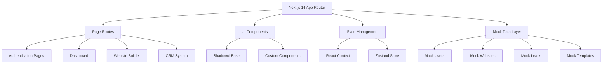

# Website Builder + CRM UI Prototype

## Architecture Overview



## Tech Stack

- **Framework**: Next.js 14+ (App Router, TypeScript)
- **Styling**: Tailwind CSS + Shadcn/ui components
- **State Management**: Zustand (lightweight, simple API)
- **Forms**: React Hook Form + Zod validation
- **Icons**: Lucide React
- **Deployment**: Vercel-ready configuration

## Project Structure

```
/app
  /(auth)
    /login
    /register
  /(dashboard)
    /dashboard              # Main dashboard
    /sites                  # Website management
      /[siteId]
        /builder            # Visual builder
        /pages              # Page management
        /media              # Media library
        /settings           # Global styles, SEO
    /leads                  # CRM interface
  /api (placeholder routes for future)
/components
  /ui (Shadcn components)
  /builder (Builder-specific)
  /forms
  /layout
/lib
  /mock-data              # Mock data generators
  /stores                 # Zustand stores
  /types                  # TypeScript types
  /utils                  # Helper functions
  /validation             # Zod schemas
/public
  /templates              # Template preview images
```

## Implementation Phases

### Phase 1: Foundation Setup (Days 1-2)

**1.1 Project Initialization**

- Initialize Next.js 14 with TypeScript
- Configure Tailwind CSS
- Install and configure Shadcn/ui
- Set up ESLint, Prettier
- Create base folder structure
- Configure Vercel deployment settings

**1.2 Design System Foundation**

- Define color palette (primary, secondary, accent)
- Configure typography scale (H1-H3, body)
- Create button variants
- Set up spacing system
- Configure responsive breakpoints
- Create design tokens in `tailwind.config.ts`

**1.3 Core Types & Schemas**

Define TypeScript interfaces in `/lib/types`:

- `User`, `Role` (SuperAdmin, InternalAdmin, BusinessUser)
- `Website`, `Page`, `Section`, `Widget`
- `Template`, `MediaAsset`
- `Lead`, `Task`, `LeadStatus`
- `GlobalStyles`, `SEOSettings`

### Phase 2: Authentication UI (Days 3-4)

**2.1 Auth Pages**

- Login page (`/app/(auth)/login/page.tsx`)
- Registration page with role selection
- Password reset flow (UI only)
- Clean, minimal design with form validation

**2.2 Auth Components**

- Form inputs with validation states
- Auth layout wrapper
- Error message display
- Success feedback
- Loading states

**2.3 Mock Authentication**

- Context provider for auth state
- Mock user data (3 roles)
- Login/logout functionality
- Protected route wrapper component

### Phase 3: Dashboard & Navigation (Days 5-6)

**3.1 Main Dashboard**

- Notion-style sidebar navigation
- Dashboard overview with widgets:
  - Website status card
  - Recent leads table
  - Task list
  - Quick actions panel
  - Site preview thumbnail
- Mobile-responsive hamburger menu
- Role-based menu items

**3.2 Navigation Components**

- Collapsible sidebar
- Breadcrumb navigation
- User profile dropdown
- Mobile bottom navigation
- Page header component

### Phase 4: Template System UI (Days 7-8)

**4.1 Template Gallery**

- Template selection page
- Grid layout with preview cards
- Template preview modal
- Template metadata display:
  - Name, description
  - Industry tags
  - Preview image
  - Section count
- "Use This Template" action

**4.2 Mock Templates**

Create 3-5 starter templates with:

- Hero + About + Services + Contact sections
- Default colors and typography
- Preview images
- JSON structure for sections/widgets

### Phase 5: Page Management (Days 9-10)

**5.1 Pages List View**

- WordPress-style page manager
- Table with columns:
  - Page name
  - Status (published/draft)
  - Last modified
  - Actions (edit, duplicate, delete)
- Create new page modal
- Set homepage toggle
- Drag-to-reorder functionality

**5.2 Page Actions**

- Create page with name/slug
- Duplicate page confirmation
- Delete confirmation modal
- Page settings drawer

### Phase 6: Website Builder Core (Days 11-15)

**6.1 Builder Layout**

- Split-screen layout:
  - Left: Section/Widget controls
  - Right: Live preview
- Mobile/tablet/desktop preview toggle
- Top toolbar with:
  - Save button
  - Preview toggle
  - Undo/redo (state history)
  - Exit to dashboard

**6.2 Section Management**

- Section list sidebar
- Add section dropdown (Hero, About, Services, Contact)
- Reorder sections (drag handles)
- Delete section confirmation
- Section settings panel

**6.3 Widget Editors**

**Hero Widget Editor**:

- Background upload (image/video)
- Headline (H1) input
- Subheadline input
- CTA button (text + URL)
- Alignment controls

**Services Widget Editor**:

- Add/remove service cards (2-6)
- Title and description per card
- Icon picker or image upload
- Card reordering

**About Widget Editor**:

- Rich text editor for content
- Image upload
- Optional CTA button

**Contact Widget Editor**:

- Form field builder:
  - Add fields (first name, last name, email, phone, message, custom)
  - Toggle required
  - Reorder fields
  - Delete fields
- Button text customization
- Confirmation message

**6.4 Live Preview**

- Real-time updates as user edits
- Responsive preview (mobile/tablet/desktop)
- Scroll synchronization
- Hover states and interactions

### Phase 7: Media Library (Days 16-17)

**7.1 Media Manager UI**

- Grid view of uploaded assets
- Upload area (drag-and-drop)
- File type filters (images/videos)
- Search/filter by name
- Delete confirmation
- Media details panel:
  - Filename
  - Size
  - Upload date
  - Used in X sections

**7.2 Media Picker Component**

- Modal overlay
- Select from library or upload new
- Preview selected media
- Insert into widget

**7.3 Mock Media Storage**

- Mock uploaded files in state
- Use placeholder images (Unsplash API or local)

### Phase 8: Global Styling System (Days 18-19)

**8.1 Global Styles Panel**

- Color pickers:
  - Primary color
  - Secondary color
  - Accent color
- Font pair selector (3-5 preset pairs)
- Button style variants
- Heading style controls (H1-H3)
- Body text style
- Real-time preview updates

**8.2 Custom Overrides**

- Per-element override toggle
- Custom font upload UI (placeholder)
- Warning when overriding global styles

### Phase 9: Header & Footer System (Days 20-21)

**9.1 Header/Footer Selector**

- Layout picker (A, B, C options)
- Visual preview cards
- Editable fields form:
  - Logo upload
  - Navigation menu items (add/remove/reorder)
  - Phone number
  - Email
  - Social links
  - Address
- Preview in builder

### Phase 10: Form Builder (Days 22-23)

**10.1 Form Configuration UI**

- Field library panel
- Drag-and-drop field placement
- Field settings:
  - Label
  - Placeholder
  - Required toggle
  - Field type (text, email, phone, textarea)
- Custom field creator
- Field reordering
- Delete field

**10.2 Form Submission Flow (Mock)**

- Mock form submission
- Loading state
- Success confirmation message
- Add lead to mock CRM data

### Phase 11: CRM Interface (Days 24-27)

**11.1 Leads Dashboard**

- Leads table with columns:
  - Name
  - Email
  - Phone
  - Status (badge)
  - Source page
  - Date created
  - Actions
- Status filter tabs
- Search by name/email
- Sort by date/status
- Pagination

**11.2 Lead Detail View**

- Slide-over panel or full page
- Contact information display
- Status dropdown selector
- Notes section (add/edit/delete)
- Tasks list with:
  - Add task form
  - Task checkbox
  - Due date display
  - Assigned user
- Activity timeline:
  - Lead created
  - Status changes
  - Notes added
  - Tasks completed

**11.3 Lead Status Management**

- Status badges (New, Contacted, In Progress, Closed, Lost)
- Color-coded status indicators
- Status change confirmation

**11.4 Tasks System**

- Task creation modal:
  - Title
  - Description
  - Due date picker
  - Assigned user dropdown
- Task list with filters
- Mark complete checkbox
- Overdue indicator

### Phase 12: SEO Tools (Days 28-29)

**12.1 SEO Settings Panel**

Per-page SEO form:

- Meta title input (character counter, max 60)
- Meta description textarea (character counter, max 160)
- Target keyword input
- Preview card (Google search result mockup)
- Warning indicators for missing fields
- Best practice tips

**12.2 Template-Based Defaults**

- Auto-populate from page title
- Suggestions based on content
- Override template defaults toggle

### Phase 13: Mobile Optimization (Days 30-31)

**13.1 Mobile Builder Experience**

- Touch-optimized controls
- Larger tap targets (44px min)
- Bottom sheet panels
- Swipe gestures
- Mobile-first form layouts
- Responsive preview

**13.2 Mobile Dashboard**

- Simplified mobile navigation
- Card-based layouts
- Bottom tab bar
- Gesture navigation
- Mobile CRM table (card view)

### Phase 14: Role-Based UI (Days 32-33)

**14.1 Super Admin Views**

- Template management page
- Section/widget creator (UI scaffolding)
- User management table
- Global presets configurator
- All websites view
- All leads view

**14.2 Internal Admin Views**

- Customer accounts list
- View-only customer website builder
- Customer leads access
- Support ticket view (placeholder)

**14.3 Business User Views**

- Limited to own website/leads
- Standard builder interface
- Own lead management only

### Phase 15: Polish & Refinement (Days 34-35)

**15.1 Interactions & Animations**

- Subtle transitions (150-300ms)
- Loading skeletons
- Toast notifications
- Hover states
- Focus indicators (accessibility)
- Empty states with illustrations

**15.2 Error Handling UI**

- Form validation errors
- Network error states
- 404 page
- Permission denied page
- Graceful fallbacks

**15.3 Accessibility**

- Keyboard navigation
- ARIA labels
- Focus traps in modals
- Color contrast validation
- Screen reader testing

## Mock Data Strategy

Create realistic mock data generators in `/lib/mock-data`:

**Users**: 3 users (one per role)

**Websites**: 5-10 sample websites with pages

**Templates**: 5 starter templates

**Leads**: 20-50 leads with various statuses

**Tasks**: 10-20 tasks linked to leads

**Media**: 20+ placeholder images

Use Zustand stores for state management:

- `useAuthStore`: Authentication state
- `useWebsiteStore`: Current website, pages, sections
- `useLeadsStore`: Leads and tasks
- `useBuilderStore`: Builder UI state (selected section, undo/redo)

## Key Files to Create

**Configuration**:

- `tailwind.config.ts` - Design tokens, theme
- `next.config.js` - Vercel optimization
- `.env.local.example` - Future API keys template

**Types**:

- `lib/types/index.ts` - All TypeScript interfaces

**Stores**:

- `lib/stores/auth.ts`
- `lib/stores/website.ts`
- `lib/stores/leads.ts`
- `lib/stores/builder.ts`

**Mock Data**:

- `lib/mock-data/users.ts`
- `lib/mock-data/websites.ts`
- `lib/mock-data/templates.ts`
- `lib/mock-data/leads.ts`

**Validation**:

- `lib/validation/schemas.ts` - Zod schemas

**Key Components**:

- `components/builder/BuilderLayout.tsx`
- `components/builder/SectionEditor.tsx`
- `components/builder/WidgetEditors/HeroWidget.tsx`
- `components/builder/LivePreview.tsx`
- `components/crm/LeadsTable.tsx`
- `components/crm/LeadDetailPanel.tsx`
- `components/forms/FormBuilder.tsx`
- `components/media/MediaLibrary.tsx`

## Security Considerations (UI Layer)

Even in UI-only phase, implement:

- Input sanitization in forms
- XSS prevention (React handles most)
- Rate limiting UI (disable buttons, show warnings)
- Form validation with Zod schemas
- No hardcoded sensitive data
- Environment variable examples in `.env.local.example`

Comments for future backend integration:

```typescript
// TODO: Replace with API call to /api/auth/login
// TODO: Add rate limiting middleware
// TODO: Validate input on server side
```

## Success Criteria

✓ Fully functional UI with no backend

✓ All major flows work with mock data

✓ Mobile-responsive on all screens

✓ Clean, minimal, Notion-style aesthetic

✓ Type-safe with TypeScript

✓ Accessible (WCAG AA)

✓ Fast performance (Lighthouse 90+)

✓ Ready for backend integration (clear API boundaries)

✓ Deployable to Vercel

## Next Steps (Post-UI Phase)

After UI approval, implement backend:

1. PostgreSQL database schema (multi-tenant)
2. Authentication (NextAuth.js or Clerk)
3. API routes for CRUD operations
4. S3 storage integration
5. Resend email integration
6. Rate limiting middleware
7. Input validation (server-side)
8. Environment variables for API keys
9. Role-based permissions (server-side)
10. Security hardening

This prototype will serve as the complete UI foundation, making backend integration straightforward by replacing mock data stores with actual API calls.